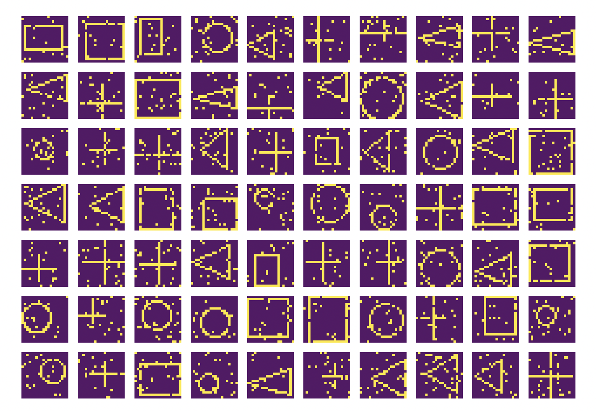
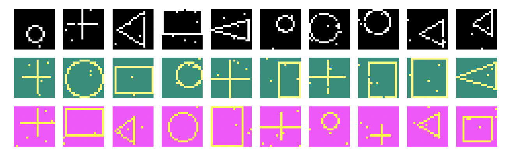
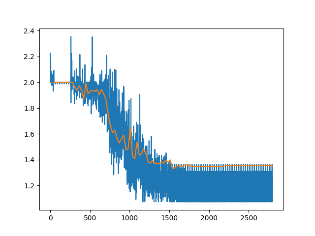

# A simple neural network built with numpy

The logic and the math for the neural network lies in network.py

The neural network model is created through a model_config where number of layers, activation function, learning rate and loss function is configured

This toy example tries to classify images of rectangles sircles, triangles and and crosses.

The number of data points, size and noise can also be adjusted in the config file under the data field.

The data is split in to a training set, validation set and test set.

The main file is called playground.py where a moch example if training the neural network i done. After training a graph of the training loss and validation loss over each epoch is displayed using matplotlib. 

